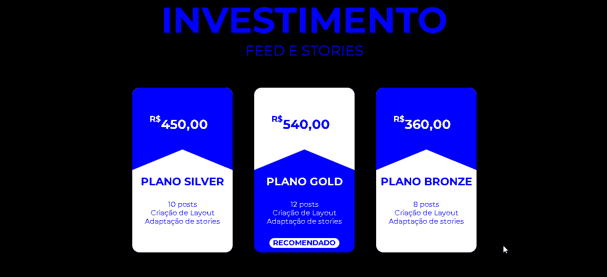

<h1 align="center">
     <a href="#" alt="jogo da cobrinha"> Pricing Table </a>
</h1>

<h4 align="center">
	🚧 Concluído 🚀 🚧
</h4>


<p align="center">
  <a href="#-sobre-o-projeto">Sobre o projeto</a>&nbsp; •
  <a href="#-funcionalidades">Funcionalidades</a>&nbsp; •
  <a href="#-como-executar-o-projeto">Como executar o projeto</a>&nbsp; •
  <a href="#-tecnologias">Tecnologias</a> 
</p>
<br />
 

## 💻 Sobre o projeto

 Uma aplicação simples que replica os cards de planos utilizados em landing pages.


---

## ⚙️ Funcionalidades

- [x] Cards de preços

---

## 🚀 Como executar o projeto

### Pré-requisitos

Antes de começar, você vai precisar ter instalado em sua máquina as seguintes ferramentas:
[Git](https://git-scm.com). 
Além disto é bom ter um editor para trabalhar com o código como [VSCode](https://code.visualstudio.com/)


#### 🧭 Rodando a aplicação web (Frontend)

```bash
# Clone este repositório
$ git clone git@github.com:CalebeFelipe/pricing-table.git
# Acesse a pasta do projeto no seu terminal/cmd
$ cd pricing-table
# Vá para a pasta da aplicação Front End
$ cd web
# Instale as dependências
$ npm install
# Execute a aplicação em modo de desenvolvimento
$ npm run start
```
---

## 🛠 Tecnologias

As seguintes ferramentas foram usadas na construção do projeto:

#### **Website**  

-   **[HTML](https://developer.mozilla.org/pt-BR/docs/Web/HTML)**
-   **[CSS](https://developer.mozilla.org/pt-BR/docs/Web/CSS)** 

#### **Utilitários**

-   Editor:  **[Visual Studio Code](https://code.visualstudio.com/)**  

---

 <sub><b>Feito com ❤️ por Calebe Felipe 👋🏽 [Entre em contato!](https://www.linkedin.com/in/calebe-felipe-alves-freitas-780b9615a/)</b></sub><br><br>
 
 <br />
 <a href="#top">Volte para o topo</a>


 
